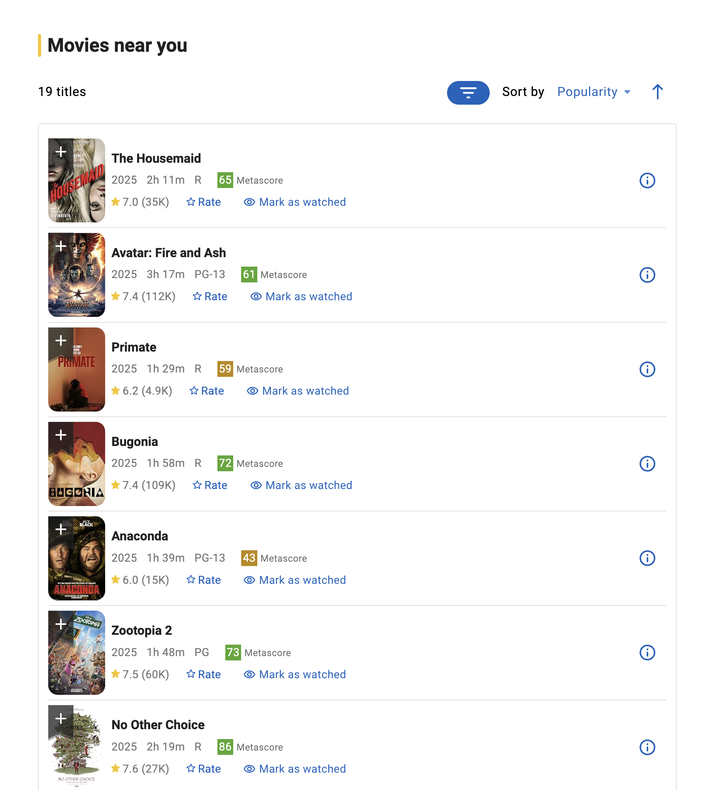
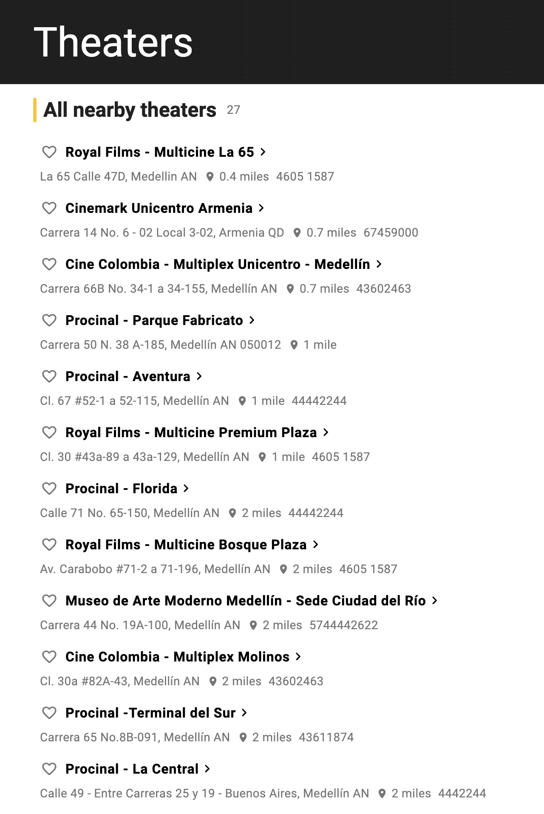
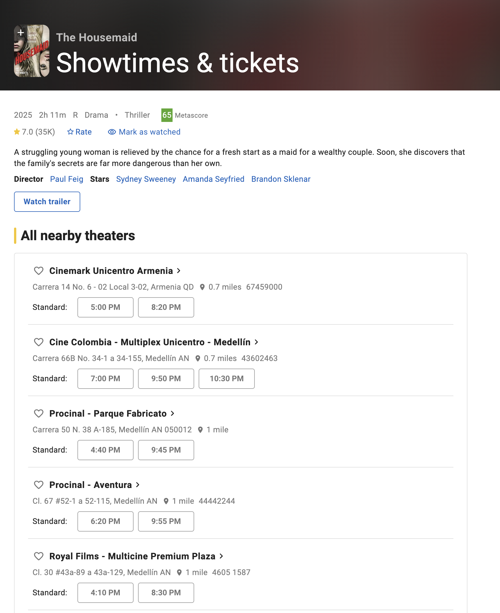
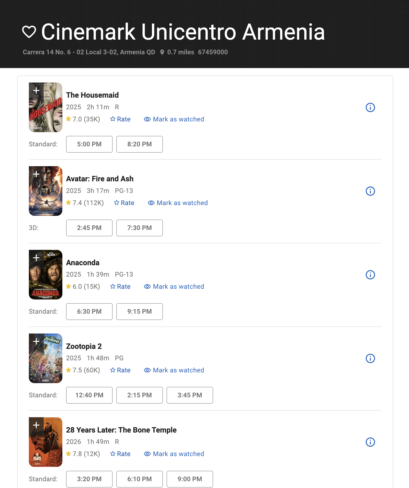

## Core Models and Data Model for Movie App

## Overview
Create core models and data model for the Movie App. This application tracks theaters, movies, and showtimes in the Medellín area.


## Models
Core Models:
- Theater
- Movie
- Showtime


## Pages
Implementation of Core pages will come in future requirements docs. However it is helpful to understand what pages will be implemented to know what the models should contain

Core Pages:
- Movies Near You
    - https://www.imdb.com/showtimes/
    - 
- Theaters Near You
    - https://www.imdb.com/showtimes/cinemas/
    - 
- Movie profile  with showtimes
    - https://www.imdb.com/showtimes/title/tt27543632/
    - 
- theater profile with Movies and showtimes
    - https://www.imdb.com/showtimes/cinema/US/ci1029922/
    - 


## Example web sites

- https://www.imdb.com/showtimes/
- https://www.colombia.com/cine/cinemark-arkadia-medellin-s304


---

# Data Model Definition

## Entity Relationship Diagram

```
┌─────────────────┐       ┌─────────────────┐       ┌─────────────────┐
│     Theater     │       │    Showtime     │       │      Movie      │
├─────────────────┤       ├─────────────────┤       ├─────────────────┤
│ id (PK)         │       │ id (PK)         │       │ id (PK)         │
│ name            │       │ theater_id (FK) │───────│ title_es        │
│ chain           │       │ movie_id (FK)   │       │ original_title  │
│ address         │       │ showtime        │       │ year            │
│ city            │       │ format          │       │ duration_minutes│
│ neighborhood    │       │ language        │       │ genre           │
│ latitude        │       │ screen          │       │ age_rating      │
│ longitude       │       │ created_at      │       │ synopsis        │
│ phone           │       │ updated_at      │       │ poster_url      │
│ screen_count    │       └─────────────────┘       │ imdb_id         │
│ website         │               │                 │ tmdb_id         │
│ is_active       │               │                 │ tmdb_rating     │
│ created_at      │               │                 │ created_at      │
│ updated_at      │               │                 │ updated_at      │
└─────────────────┘               │                 └─────────────────┘
        │                         │
        └─────────────────────────┘
```

## Relationships
- A **Theater** has many **Showtimes**
- A **Movie** has many **Showtimes**
- A **Showtime** belongs to one **Theater** and one **Movie**


---

# Model Class Definitions

## Theater Model

Represents a movie theater/cinema location.

| Field | Type | Constraints | Description |
|-------|------|-------------|-------------|
| id | BigAutoField | PK | Primary key |
| name | CharField(200) | required | Theater name (e.g., "Arkadia") |
| slug | SlugField(200) | required, unique | URL-friendly identifier (e.g., "cinemark-arkadia-medellin") |
| chain | CharField(100) | optional | Theater chain (e.g., "Cinemark", "Cine Colombia") |
| address | CharField(300) | required | Street address |
| city | CharField(100) | required, default="Medellín" | City name |
| neighborhood | CharField(100) | optional | Neighborhood/barrio name |
| latitude | DecimalField(9,6) | optional | GPS latitude |
| longitude | DecimalField(9,6) | optional | GPS longitude |
| phone | CharField(50) | optional | Contact phone number |
| screen_count | PositiveIntegerField | optional | Number of screens/salas |
| website | URLField | optional | Theater website URL |
| is_active | BooleanField | default=True | Whether theater is currently operating |
| created_at | DateTimeField | auto_now_add | Record creation timestamp |
| updated_at | DateTimeField | auto_now | Record update timestamp |

**Indexes:**
- `slug` - unique, for URL lookups
- `city` - for filtering theaters by city
- `chain` - for filtering by theater chain
- `is_active` - for filtering active theaters

**String representation:** `{name} - {city}`


## Movie Model

Represents a film that can be shown at theaters.

| Field | Type | Constraints | Description |
|-------|------|-------------|-------------|
| id | BigAutoField | PK | Primary key |
| title_es | CharField(300) | required | Movie title in Spanish |
| original_title | CharField(300) | optional | Original language title |
| year | PositiveIntegerField | optional | Release year |
| duration_minutes | PositiveIntegerField | optional | Runtime in minutes |
| genre | CharField(100) | optional | Primary genre(s) |
| age_rating | CharField(10) | optional | Age rating (e.g., "PG-13", "R", "+15") |
| synopsis | TextField | optional | Movie description/plot summary |
| poster_url | URLField | optional | URL to movie poster image |
| imdb_id | CharField(20) | optional, unique | IMDB identifier (e.g., "tt27543632") |
| tmdb_id | PositiveIntegerField | optional, unique | The Movie Database (TMDB) identifier |
| tmdb_rating | DecimalField(3,1) | optional | TMDB user rating (0.0-10.0) |
| created_at | DateTimeField | auto_now_add | Record creation timestamp |
| updated_at | DateTimeField | auto_now | Record update timestamp |

**Indexes:**
- `title_es` - for searching movies by title
- `imdb_id` - unique, for external lookups
- `tmdb_id` - unique, for TMDB lookups
- `year` - for filtering by release year

**String representation:** `{title_es} ({year})`


## Showtime Model

Represents a specific showing of a movie at a theater.

**Note:** All showtimes are stored as timezone-aware datetimes (UTC). Display conversion to local time (e.g., Colombia Time) should be handled at the presentation layer.

| Field | Type | Constraints | Description |
|-------|------|-------------|-------------|
| id | BigAutoField | PK | Primary key |
| theater | ForeignKey(Theater) | required, on_delete=CASCADE | Theater showing the movie |
| movie | ForeignKey(Movie) | required, on_delete=CASCADE | Movie being shown |
| showtime | DateTimeField | required | Date and time of showing (timezone-aware, stored as UTC) |
| format | CharField(50) | optional | Screening format (e.g., "2D", "3D", "IMAX", "XD") |
| language | CharField(50) | optional | Audio language (e.g., "DOBLADA", "SUBTITULADA", "Original") |
| screen | CharField(50) | optional | Screen/sala identifier |
| source_url | URLField | optional | URL where this showtime was scraped from |
| created_at | DateTimeField | auto_now_add | Record creation timestamp |
| updated_at | DateTimeField | auto_now | Record update timestamp |

**Indexes:**
- `showtime` - for filtering by date/time
- `theater, showtime` - composite index for theater schedule queries
- `movie, showtime` - composite index for movie availability queries

**Constraints:**
- `unique_together: (theater, movie, showtime, format, language)` - Prevent duplicate showtime entries

**String representation:** `{movie.title} at {theater.name} - {showtime}`


---

# Format and Language Choices

## Format Choices
Common screening formats observed:
- `2D` - Standard 2D projection
- `3D` - 3D projection
- `IMAX` - IMAX format
- `XD` - Cinemark XD (Extreme Digital)
- `4DX` - 4D experience with motion seats
- `DBOX` - D-BOX motion seats

## Language Choices
Common language options for Colombian theaters:
- `DOBLADA` - Dubbed in Spanish
- `SUBTITULADA` - Subtitled (original audio with Spanish subtitles)
- `ORIGINAL` - Original language without subtitles
- `ESPAÑOL` - Spanish language film


---

# Usage Examples

## Query: Movies showing near me today
```python
from django.utils import timezone
from movies_app.models import Showtime

today = timezone.now().date()
showtimes = Showtime.objects.filter(
    showtime__date=today,
    theater__city="Medellín",
    theater__is_active=True
).select_related('movie', 'theater').order_by('showtime')
```

## Query: All showtimes for a specific movie
```python
movie_showtimes = Showtime.objects.filter(
    movie__title="Avatar: Fuego Y Cenizas",
    showtime__gte=timezone.now()
).select_related('theater').order_by('theater__name', 'showtime')
```

## Query: Theater schedule
```python
theater_schedule = Showtime.objects.filter(
    theater__name="Arkadia",
    showtime__date=today
).select_related('movie').order_by('showtime')
```

