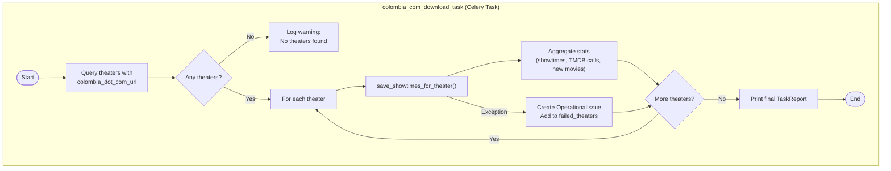
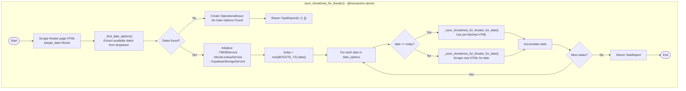
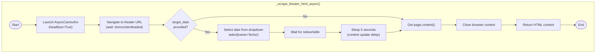
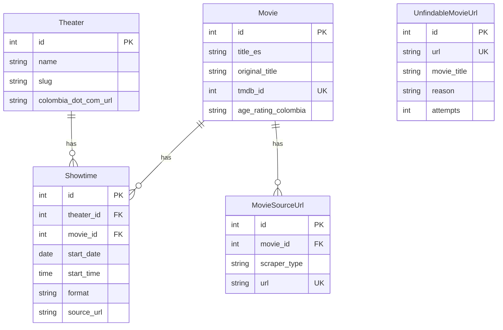

# Scraper Flow Diagram

This document provides a detailed Mermaid flow diagram of the colombia.com download task logic, including the TMDB service integration and movie matching algorithm.

## High-Level Task Flow

## Theater Processing Flow

## Date Processing Flow

```mermaid
flowchart TB
    subgraph ProcessDate["_save_showtimes_for_theater_for_date()"]
        Start([Start]) --> HasHTML{html_content<br/>provided?}
        HasHTML -->|No| ScrapeHTML["Scrape theater page<br/>for target_date"]
        HasHTML -->|Yes| UseHTML["Use provided HTML"]

        ScrapeHTML --> ExtractMovies
        UseHTML --> ExtractMovies["_extract_showtimes_from_html()<br/>Parse movie boxes"]

        ExtractMovies --> HasMovies{Movies found?}
        HasMovies -->|No| LogWarning["Log warning:<br/>No showtimes found"]
        LogWarning --> ReturnEmpty["Return TaskReport(0, 0, [])"]

        HasMovies -->|Yes| CalcDate["effective_date =<br/>target_date or today"]
        CalcDate --> DeleteOld["DELETE existing showtimes<br/>for theater + date"]
        DeleteOld --> LoopMovies["For each MovieShowtimes"]

        LoopMovies --> GetMovie["_get_or_create_movie_colombia()"]
        GetMovie --> HasMovie{movie found?}
        HasMovie -->|No| SkipMovie["Skip this movie<br/>(continue)"]
        SkipMovie --> MoreMovies

        HasMovie -->|Yes| LoopFormats["For each format description"]
        LoopFormats --> LoopTimes["For each start_time"]
        LoopTimes --> CreateShowtime["Showtime.objects.create()"]
        CreateShowtime --> IncrementCount["showtimes_saved += 1"]
        IncrementCount --> MoreTimes{More times?}
        MoreTimes -->|Yes| LoopTimes
        MoreTimes -->|No| MoreFormats{More formats?}
        MoreFormats -->|Yes| LoopFormats
        MoreFormats -->|No| MoreMovies{More movies?}
        MoreMovies -->|Yes| LoopMovies
        MoreMovies -->|No| ReturnReport["Return TaskReport"]
        ReturnReport --> End([End])
    end
```

## Movie Lookup Flow

```mermaid
flowchart TB
    subgraph GetOrCreateMovie["_get_or_create_movie_colombia()"]
        Start([Start]) --> HasURL{movie_url<br/>provided?}

        HasURL -->|Yes| CheckExisting["Check MovieSourceUrl<br/>for existing movie"]
        CheckExisting --> ExistsInDB{Found?}
        ExistsInDB -->|Yes| ReturnExisting["Return MovieLookupResult<br/>(movie, is_new=False, tmdb_called=False)"]

        ExistsInDB -->|No| CheckUnfindable["Check UnfindableMovieUrl"]
        CheckUnfindable --> IsUnfindable{Known<br/>unfindable?}
        IsUnfindable -->|Yes| IncrementAttempts["attempts += 1"]
        IncrementAttempts --> ReturnNone1["Return MovieLookupResult<br/>(None, is_new=False, tmdb_called=False)"]

        IsUnfindable -->|No| ScrapeMetadata["_scrape_and_create_metadata()"]
        HasURL -->|No| ScrapeMetadata

        ScrapeMetadata --> MetadataOK{Metadata<br/>extracted?}
        MetadataOK -->|No| RecordUnfindable["Record as unfindable<br/>(NO_METADATA reason)"]
        RecordUnfindable --> CallLookupService
        MetadataOK -->|Yes| CallLookupService["MovieLookupService<br/>.get_or_create_movie()"]

        CallLookupService --> CheckNewMovie{is_new AND<br/>has classification?}
        CheckNewMovie -->|Yes| CheckAgeRating{Missing<br/>age_rating_colombia?}
        CheckAgeRating -->|Yes| SetAgeRating["Set age_rating_colombia<br/>from classification"]
        SetAgeRating --> ReturnResult
        CheckAgeRating -->|No| ReturnResult
        CheckNewMovie -->|No| ReturnResult["Return MovieLookupResult"]
        ReturnResult --> End([End])
    end
```

## MovieLookupService Flow

```mermaid
flowchart TB
    subgraph LookupService["MovieLookupService.get_or_create_movie()"]
        Start([Start]) --> CheckSourceURL{source_url<br/>provided?}

        CheckSourceURL -->|Yes| CheckExistingURL["Check MovieSourceUrl<br/>by scraper_type + url"]
        CheckExistingURL --> URLExists{Found?}
        URLExists -->|Yes| ReturnExisting["Return (existing movie,<br/>is_new=False, tmdb_called=False)"]

        URLExists -->|No| CheckUnfindableURL["Check UnfindableMovieUrl"]
        CheckUnfindableURL --> IsUnfindable{Known<br/>unfindable?}
        IsUnfindable -->|Yes| ReturnNone["Return (None,<br/>is_new=False, tmdb_called=False)"]

        IsUnfindable -->|No| DetermineSearchName
        CheckSourceURL -->|No| DetermineSearchName["search_name =<br/>metadata.original_title or movie_name"]

        DetermineSearchName --> SearchTMDB["TMDBService.search_movie()"]
        SearchTMDB --> HasResults{Results found?}
        HasResults -->|No| RecordUnfindable1["Record unfindable<br/>(NO_TMDB_RESULTS)"]
        RecordUnfindable1 --> ReturnNone2["Return (None,<br/>is_new=False, tmdb_called=True)"]

        HasResults -->|Yes| FindBestMatch["find_best_tmdb_match()"]
        FindBestMatch --> MatchFound{Match found?}
        MatchFound -->|No| RecordUnfindable2["Record unfindable<br/>(NO_MATCH)"]
        RecordUnfindable2 --> ReturnNone3["Return (None,<br/>is_new=False, tmdb_called=True)"]

        MatchFound -->|Yes| CheckExistingTMDB["Check Movie by tmdb_id"]
        CheckExistingTMDB --> TMDBExists{Found?}
        TMDBExists -->|Yes| CreateSourceURL["Create/Update MovieSourceUrl"]
        CreateSourceURL --> ReturnExisting2["Return (existing movie,<br/>is_new=False, tmdb_called=True)"]

        TMDBExists -->|No| CreateMovie["Movie.create_from_tmdb()<br/>with title_override=movie_name"]
        CreateMovie --> CreateSourceURL2["Create MovieSourceUrl"]
        CreateSourceURL2 --> ReturnNew["Return (new movie,<br/>is_new=True, tmdb_called=True)"]
        ReturnNew --> End([End])
    end
```

## TMDB Matching Algorithm

```mermaid
flowchart TB
    subgraph MatchAlgorithm["find_best_tmdb_match()"]
        Start([Start]) --> HasResults{Any TMDB<br/>results?}
        HasResults -->|No| ReturnNone["Return None"]

        HasResults -->|Yes| HasMetadata{Has metadata?}
        HasMetadata -->|No| LogWarning["Log: No metadata available"]
        LogWarning --> ReturnFirst["Return first result"]

        HasMetadata -->|Yes| InitVars["best_match = None<br/>best_score = -1<br/>has_date_match = False"]
        InitVars --> LoopResults["For each TMDB result"]

        LoopResults --> ParseTMDBDate["Parse TMDB release_date<br/>to date object"]
        ParseTMDBDate --> ExactDateMatch{source_date ==<br/>tmdb_date?}
        ExactDateMatch -->|Yes| ReturnImmediate["Return this result<br/>(early exit)"]

        ExactDateMatch -->|No| CalcYearScore["Calculate year score:<br/>same year: +100<br/>±1 year: +50<br/>other: -50"]
        CalcYearScore --> CalcTitleScore["Calculate title score:<br/>exact match: +30<br/>partial match: +15"]
        CalcTitleScore --> CalcOriginalScore["Calculate original_title score:<br/>exact match: +20<br/>partial match: +10"]
        CalcOriginalScore --> CalcPositionBonus["Position bonus:<br/>max(0, 10 - index)"]

        CalcPositionBonus --> ShouldFetchDetails{index < 5 AND<br/>has director/actors?}
        ShouldFetchDetails -->|Yes| FetchDetails["Fetch TMDB movie details<br/>(include_credits=True)"]
        FetchDetails --> CompareDirector["Director match: +150"]
        CompareDirector --> CompareActors["Actor matches:<br/>+30 per actor (max 90)"]
        CompareActors --> UpdateBest
        ShouldFetchDetails -->|No| UpdateBest["Update best_match<br/>if score > best_score"]

        UpdateBest --> MoreResults{More results?}
        MoreResults -->|Yes| LoopResults
        MoreResults -->|No| LogSelection["Log selected match"]
        LogSelection --> ReturnBest["Return best_match"]
        ReturnBest --> End([End])
    end
```

## TMDB Matching Score Summary

| Criteria | Points | Notes |
|----------|--------|-------|
| **Date Matching** | | |
| Exact date match | **Early return** | Immediate best match |
| Same year | +100 | |
| ±1 year | +50 | Common for international releases |
| >1 year difference | -50 | Penalty |
| **Title Matching** | | |
| Exact title match | +30 | Case-insensitive |
| Partial title match | +15 | Substring |
| Exact original_title | +20 | |
| Partial original_title | +10 | |
| **Credits Matching** (top 5 results only) | | |
| Director match | +150 | Normalized name comparison |
| Actor match | +30 each | Max 90 (3 actors) |
| **Position** | | |
| Position bonus | +10 to +1 | max(0, 10 - index) |

## HTML Scraping Flow

## Data Models

